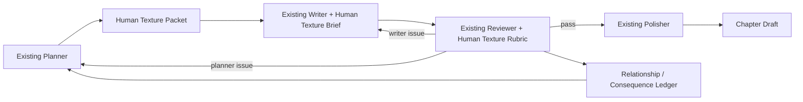

# Integration With Existing Skill-Pack

日期：2026-06-03

本文件只提出嵌入方案，不修改 `skill-pack/`。

## 当前 skill-pack 观察

已阅读：

- `skill-pack/creation_skills/webnovel_planner/SKILL.md`
- `skill-pack/creation_skills/webnovel_writer/SKILL.md`
- `skill-pack/creation_skills/webnovel_reviewer/SKILL.md`
- `skill-pack/creation_skills/webnovel_polisher/SKILL.md`
- `skill-pack/analysis_skills/detect_webnovel_ai_flavor/SKILL.md`

现状：

- Planner 已能处理认知优势、内化压力、规则揭示阶段。
- Writer 已能执行事件开章、行动展示、规则破局、章尾推进。
- Reviewer 已有 14 项 webnovel 维度，但主要关注钩子、节奏、payoff、模板风险。
- Polisher 是轻增强，不应承担结构性补救。
- AI flavor detector 能识别部分语言层 AI 味，但不是 Human Texture rubric。

## 嵌入原则

1. 不替换现有 skill-pack。
2. 不把 Human Texture 放到 Polisher 末端硬救。
3. 不降低 Phase 8 已验证的机制能力。
4. 把 Human Texture 变成 Planner / Writer / Reviewer 的合同。
5. 所有人味改造必须可追踪：来自哪笔私心、关系债、场景阻力或后果账。

## 推荐架构



## Planner 层嵌入

新增输出，不改原有输出结构的情况下，可作为附加块：

```yaml
human_texture_packet:
  pov_character:
    private_want: ""
    shame_or_avoidance: ""
    imperfect_choice: ""
  side_characters:
    - name: ""
      visible_plot_function: ""
      private_agenda: ""
      relationship_debt_change: ""
  scene_texture:
    scene_life_function: ""
    scene_resistance: ""
    non_instrumental_detail: ""
  information_exposure:
    key_info: ""
    carrier: ""
    misread_or_withholding: ""
    exposure_cost: ""
  consequence_ledger:
    inherited_cost: ""
    new_cost: ""
    next_chapter_friction: ""
  human_aftertaste_beat: ""
```

Planner 责任：

- 不只安排“本章揭示什么规则”，还要安排“谁通过什么代价知道这条规则”。
- 不只安排“主角如何破局”，还要安排“破局让他失去什么”。
- 不只安排“配角如何推动剧情”，还要安排“配角自己怕什么、图什么”。

## Writer 层嵌入

Writer 接收 `human_texture_packet` 后，执行以下约束：

- 每个关键机制节点必须落到一个动作、错话、迟疑、遮掩或身体反应。
- 每个配角出场至少携带一个不完全服务主线的小目标。
- 每章最多 1-2 个非工具性细节，不能堆散文化描写。
- 设定信息优先通过行动、误读、旁观者、物件或制度露出。
- 章尾钩子后保留一个人味余波。

Writer 禁止：

- 用大段内心总结替代行为后果。
- 用公告、权威长对白、系统界面一次性交代复杂信息。
- 把“人味”理解为加风景、加比喻、加口语。

## Reviewer 层嵌入

Reviewer 增加 Human Texture 评分：

- 人物可信度。
- 私心 / 羞耻 / 犹豫。
- 情绪真实度。
- 关系摩擦。
- 场景生活质感。
- 非工具性细节。
- 信息露出自然度。
- 代价真实后果。
- 语言光泽和余味。
- 系统展示感。

Reviewer 必须输出：

```yaml
human_texture_review:
  pass: true
  average_score: 0
  hard_fails:
    - dimension: ""
      evidence: ""
      return_to: "planner|writer|polisher"
  required_revision_brief:
    - ""
  ledger_updates:
    relationship_debt:
      - ""
    consequence:
      - ""
```

Hard fail 规则：

- 系统展示感低于 3：退回 Planner/Writer。
- 代价后果低于 3：退回 Planner。
- 人物功能件明显：退回 Planner。
- 语言顺滑但无余味：结构合格时交给 Polisher。

## Polisher 层嵌入

Polisher 只做：

- 删减主题总结句。
- 调整重复句式。
- 加强章尾留白。
- 让动作和对话更贴人物状态。

Polisher 不做：

- 补人物私心。
- 重新设计关系债。
- 重排信息露出。
- 补场景生活逻辑。

若 Polisher 发现结构性缺失，应返回 Reviewer 标注的层级。

## 状态账本

未来建议新增两个轻量账本，不需要全量 corpus：

### Relationship Debt Ledger

记录：

- 谁欠谁。
- 谁误会谁。
- 谁隐瞒了什么。
- 谁救过谁但没有被感谢。
- 谁因为主角受损。
- 下一章如何体现。

### Consequence Ledger

记录：

- 身体后果。
- 情绪残留。
- 声誉变化。
- 资源损失。
- 时间压力。
- 关系损耗。

这两个账本是 Human Texture 能跨章生效的关键。

## 与现有 Phase 8 的关系

Phase 8 minimal injection 已经验证：

- 选少量 approved patterns 注入是可行的。
- Planner / Writer / Reviewer 能理解技法 contract。
- Polisher light 不适合结构性救稿。

Human Texture 应继承这个经验：

- 第一阶段只做最小注入。
- 不碰 craft_assets。
- 不新增 approved_patterns。
- 先用 5 章失败样本做 baseline。

## 推荐实施顺序

1. 在 `production/human_texture/experiment_mvp/` 增加实验 prompt 和 schema。
2. 用 C4 柳青砚关系节点做第一个片段实验。
3. 用 C3 饭堂/矿洞信息露出做第二个片段实验。
4. Reviewer 用 rubric 做 A/B 对照。
5. 通过后再考虑修改 skill-pack。

## 风险

- 过度文学化：会拖慢网文节奏。
- 过度细节化：会把非工具性细节写成装饰。
- 过度人审依赖：会降低自动化效率。
- 后置润色幻觉：看起来更顺，但结构仍空。

控制方式：

- 每个细节必须贴人物处境。
- 每个后果必须进入下一章账本。
- 每个低分项必须明确回到对应层修。
