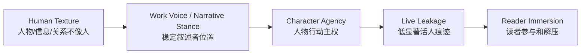
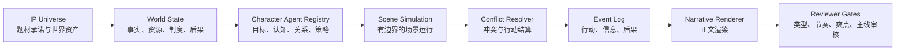
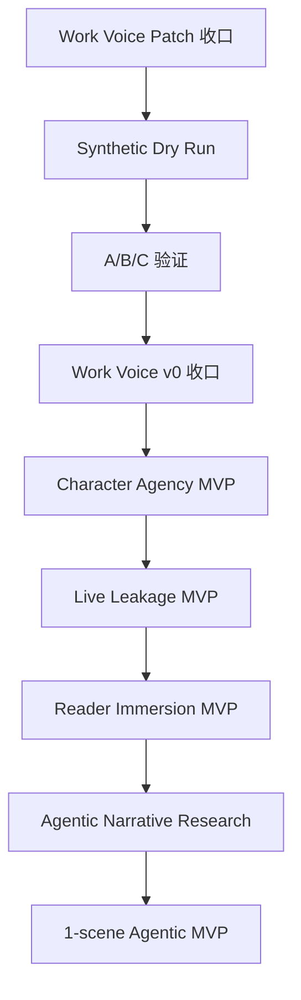

# Roadmap Mermaid

## Figure 1: Current Generation Pipeline Enhancement

```mermaid
flowchart LR
  HT["Human Texture<br/>人物/信息/关系不像人"] --> WV["Work Voice / Narrative Stance<br/>稳定叙述者位置"]
  WV --> CA["Character Agency<br/>人物行动主权"]
  CA --> LL["Live Leakage<br/>低显著活人痕迹"]
  LL --> RI["Reader Immersion<br/>读者参与和解压"]
```

## Figure 2: Agentic Narrative Engine

```mermaid
flowchart LR
  IP["IP Universe<br/>题材承诺与世界资产"] --> WS["World State<br/>事实、资源、制度、后果"]
  WS --> CAR["Character Agent Registry<br/>目标、认知、关系、策略"]
  CAR --> SS["Scene Simulation<br/>有边界的场景运行"]
  SS --> CR["Conflict Resolver<br/>冲突与行动结算"]
  CR --> EL["Event Log<br/>行动、信息、后果"]
  EL --> NR["Narrative Renderer<br/>正文渲染"]
  NR --> RG["Reviewer Gates<br/>类型、节奏、爽点、主线审核"]
```

## Figure 3: Execution Sequence

```mermaid
flowchart TD
  A["Work Voice Patch 收口"] --> B["Synthetic Dry Run"]
  B --> C["A/B/C 验证"]
  C --> D["Work Voice v0 收口"]
  D --> E["Character Agency MVP"]
  E --> F["Live Leakage MVP"]
  F --> G["Reader Immersion MVP"]
  G --> H["Agentic Narrative Research"]
  H --> I["1-scene Agentic MVP"]
```
